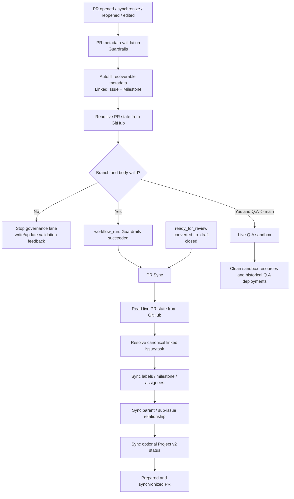

# PR Governance Architecture

## Purpose

This document is the execution contract for pull request governance in GitHub Project Automation (GPA).

The reference behavior comes from the proven Take Your Pills governance lane. The important invariant is the ordering of state-changing and state-consuming stages:

> **Autofill -> Guardrails -> PR Sync**

PR Sync is the generic GPA successor to the reference repository's PR Hygiene stage. Autofill is not part of PR Sync execution; it is a preparation step inside Guardrails.

## Architecture



## Why the order matters

`pull_request_target` payloads are snapshots. If Autofill changes a PR body and a synchronization stage immediately consumes the original event payload, that stage can observe stale metadata.

GPA therefore does not use the original PR-event body as the handoff from Autofill to PR Sync.

The safe handoff is:

1. Autofill mutates the real pull request through the GitHub API.
2. Guardrails validates the **live pull request** from GitHub.
3. A successful Guardrails run emits a separate `workflow_run` event.
4. PR Sync resolves the associated PR number and fetches the **live pull request** again before synchronization.

This is the same architectural fix used by the Take Your Pills reference after stale PR state was observed in independent governance workflows.

## Workflow responsibilities

### `.github/workflows/pr-metadata.yml` — Guardrails role

Triggers directly from trusted `pull_request_target` events:

- `opened`;
- `synchronize`;
- `reopened`;
- `edited`.

Execution order inside the workflow:

1. Checkout the trusted base commit.
2. Run `project_setup.pr_autofill`.
3. Run `scripts/validation/validate_pr_body.py`.
4. The validator reads the live PR through the GitHub API when repository and PR number are available.
5. For a valid `Q.A -> main` promotion, run the live Q.A sandbox and its cleanup lane.

Guardrails owns validation. It does not synchronize task-derived PR metadata.

### `.github/workflows/pr-sync.yml` — Sync/Hygiene role

Normal implementation synchronization is triggered only by:

```text
workflow_run(PR metadata validation = success)
```

Direct `pull_request_target` handling is restricted to lifecycle events that need a state transition without another implementation validation pass:

- `ready_for_review`;
- `converted_to_draft`;
- `closed`.

For a `workflow_run`, `project_setup.pr_sync` reconstructs the context by fetching the associated pull request from GitHub. It must not use a stale body inherited from the original PR webhook.

PR Sync owns:

- linked implementation issue/task resolution;
- configured label synchronization;
- milestone synchronization;
- assignee synchronization;
- parent/sub-issue synchronization;
- optional Project v2 membership/status synchronization;
- the marked PR Sync status comment.

## Promotion pull requests

Implementation-task mutation is skipped for configured promotion paths. The GPA defaults are:

```text
develop -> Q.A
Q.A -> main
```

These PRs can still pass Guardrails and can participate in promotion-specific validation such as live Q.A, but PR Sync must not invent or require an implementation task for them.

## Authentication boundary

Repository-scoped PR/issue operations use the built-in Actions token:

```text
github.token
```

The relevant workflows request:

```yaml
permissions:
  contents: read
  issues: write
  pull-requests: write
```

This token is used for PR body updates, comments, labels, milestones, assignees, and repository-scoped issue relationships.

`PROJECT_SETUP_PAT` is an optional, separate boundary for GitHub Projects v2 operations. Missing Project v2 credentials must not prevent repository-scoped PR synchronization.

## Security invariants

- Privileged automation executes trusted base/default-branch code.
- PR head code is never executed with write credentials by the governance lane.
- Fork PRs are skipped by privileged mutations.
- `persist-credentials` is disabled on trusted checkouts.
- Guardrails must succeed before normal PR Sync runs.
- Normal PR Sync must fetch live PR state after Guardrails.
- Promotion PR exclusions are evaluated before implementation-task mutation.
- Project v2 credentials remain isolated from ordinary repository mutations.

## Regression contract

A newly opened implementation PR with a deterministically resolvable branch may start with placeholder Linked Issue/Milestone fields. Without manual editing, rerunning, or adding a second commit, the automation must converge to:

```text
Autofill live PR
  -> validate live PR
  -> successful workflow_run
  -> refetch live PR
  -> PR Sync
```

If Guardrails fails, normal PR Sync must not run.

The workflow contract tests in `tests/test_pr_sync.py` and `tests/test_pr_sync_autofill.py` protect this ordering and the live-state refetch behavior.
