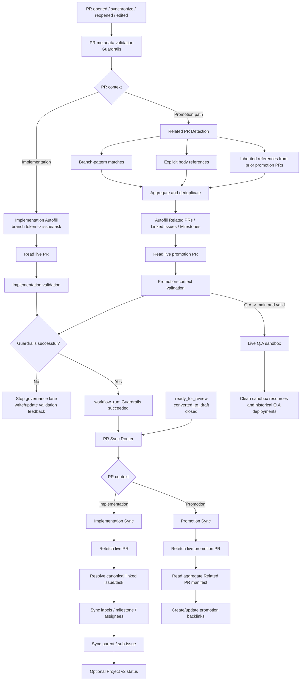

# PR Governance Architecture

## Purpose

This document is the execution contract for pull request governance in GitHub Project Automation (GPA).

The reference behavior comes from the proven Take Your Pills governance lane, but GPA generalizes the repository-specific release logic into configurable Related PR Detection.

The invariant remains:

> **Autofill -> Guardrails -> PR Sync**

The important addition is that Autofill and PR Sync are now routed by PR context:

- implementation PRs use one canonical linked issue/task;
- promotion PRs use an aggregate set of related PRs.

## Architecture



## Why the order matters

`pull_request_target` payloads are snapshots. If Autofill changes a PR body and a synchronization stage immediately consumes the original event payload, that stage can observe stale metadata.

The safe handoff is therefore:

1. Autofill mutates the real pull request through the GitHub API.
2. Guardrails validates the **live pull request**.
3. Successful Guardrails emits a separate `workflow_run` event.
4. PR Sync refetches the **live pull request** before synchronization.

This is the same architectural lesson learned in Take Your Pills after stale PR state was observed between independent automation stages.

## Implementation PR flow

Implementation PRs keep the existing deterministic model:

```text
branch
  -> explicit issue/task token or configured backlog mapping
  -> one canonical issue/task
  -> Linked Issue + Milestone
  -> Guardrails
  -> PR Sync
```

Closing references such as `Closes #123`, `Fixes #123`, or `Resolves #123` remain authoritative when already present.

## Promotion PR flow

Configured promotion paths are **routing rules**, not skip rules.

The committed GPA paths are:

```text
develop -> Q.A
Q.A -> main
```

A promotion PR receives an aggregate context instead of one implementation task.

### Related PR Detection

GPA combines two primary discovery mechanisms and one propagation mechanism:

1. **Branch-pattern detection** — merged PRs entering the promotion source branch whose head branch matches configured regexes.
2. **Body references** — PR numbers explicitly listed in configured sections such as `## Related PRs`.
3. **Inherited references** — a later promotion can inherit Related PRs declared by an earlier promotion PR merged into its source branch.

The result is unioned and deduplicated.

Default branch patterns are intentionally broad examples:

```text
^feat/
^fix/
^docs/
^refactor/
^test/
^hotfix/
^phase/
^task/
^chore/
^ci/
^release/
```

They are configuration, not engine constants. A target repository can replace the entire list with its own convention, for example:

```json
{
  "prAutomation": {
    "relatedPrs": {
      "branchPatterns": ["^work/", "^bug/"]
    }
  }
}
```

Explicit body references continue to work even when the referenced PR branch does not match a configured branch pattern.

### Detection window

For `develop -> Q.A`, automatic discovery considers PRs merged into `develop` after the previous merged `develop -> Q.A` promotion.

For `Q.A -> main`, the detector considers PRs merged into `Q.A` after the previous merged `Q.A -> main` promotion. When those source PRs are themselves promotions, their `Related PRs` sections are inherited so only already-promoted implementation work propagates toward `main`.

If no previous promotion exists, `fallbackDays` defines the bounded initial lookback. The committed default is seven days. Explicit body references are not dependent on the branch-pattern discovery window.

## Promotion Autofill contract

For promotion PRs, Related PR Detection may deterministically populate:

- `## Related PRs` from detected source PRs;
- `## Linked Issue` from closing references contained in those related PRs;
- `## Milestone` from unique milestones present on those related PRs;
- `## Summary` only when the section is still a placeholder.

Human-authored summaries, risks, evidence, testing notes, and DoD decisions are preserved.

## Promotion validation contract

Promotion Guardrails verify that:

- the PR is a configured promotion path;
- at least one merged PR appears in the configured Related PR section;
- referenced PRs are actually merged;
- automatically detected related PRs are not silently omitted.

Promotion PRs therefore no longer mean "skip validation". They use a different validation contract.

## PR Sync routing

`.github/workflows/pr-sync.yml` invokes `project_setup.pr_sync_router`.

The router performs exactly one of two modes:

```text
implementation PR -> project_setup.pr_sync
promotion PR      -> project_setup.related_prs promotion sync
```

Implementation Sync continues to own task-derived metadata, parent/sub-issue linkage, and optional Project v2 lifecycle synchronization.

Promotion Sync owns the aggregate promotion manifest and idempotent backlinks from each related PR to the promotion PR. It does not copy metadata from an arbitrary first issue/task.

## Workflow responsibilities

### `.github/workflows/pr-metadata.yml` — Guardrails

Execution order:

1. Checkout trusted base commit.
2. Run promotion Related PR Autofill when applicable.
3. Run implementation Autofill when applicable.
4. Validate the live implementation PR contract.
5. Validate the live promotion context when applicable.
6. For a valid `Q.A -> main` PR, run live Q.A and cleanup.

### `.github/workflows/pr-sync.yml` — Sync/Hygiene

Normal synchronization runs from:

```text
workflow_run(PR metadata validation = success)
```

Direct lifecycle events remain:

- `ready_for_review`;
- `converted_to_draft`;
- `closed`.

The router refetches live PR state through the implementation or promotion path as appropriate.

## Configuration

The related-PR contract lives under `prAutomation.relatedPrs`:

```json
{
  "prAutomation": {
    "relatedPrs": {
      "enabled": true,
      "branchPatterns": [
        "^feat/",
        "^fix/",
        "^docs/",
        "^refactor/",
        "^test/",
        "^hotfix/",
        "^phase/",
        "^task/",
        "^chore/",
        "^ci/",
        "^release/"
      ],
      "bodySections": ["Related PRs", "Related Pull Requests"],
      "includeBranchMatches": true,
      "includeBodyReferences": true,
      "inheritBodyReferences": true,
      "fallbackDays": 7
    },
    "sync": {
      "promotionPaths": [
        {"head": "develop", "base": "Q.A"},
        {"head": "Q.A", "base": "main"}
      ]
    }
  }
}
```

There is no promotion skip switch in the committed configuration. `promotionPaths` selects promotion mode.

## Authentication boundary

Repository-scoped PR/issue operations use the built-in Actions token:

```text
github.token
```

The relevant workflows request:

```yaml
permissions:
  contents: read
  issues: write
  pull-requests: write
```

`PROJECT_SETUP_PAT` remains optional and separate for GitHub Projects v2 operations. Related PR Detection and Promotion Sync do not require the Project PAT.

## Security invariants

- Privileged automation executes trusted base/default-branch code.
- PR head code is never executed with write credentials by the governance lane.
- Fork PRs remain excluded from privileged mutations.
- `persist-credentials` is disabled on trusted checkouts.
- Guardrails must succeed before normal PR Sync runs.
- PR Sync must consume live PR state after Guardrails.
- Promotion paths route to aggregate synchronization instead of implementation-task mutation.
- Explicit Related PR references are verified as actual merged PRs.
- Project v2 credentials remain isolated from ordinary repository mutations.

## Regression contract

A new implementation PR must converge without a second event:

```text
Implementation Autofill
  -> validate live PR
  -> workflow_run
  -> refetch live PR
  -> Implementation Sync
```

A promotion PR must converge without manually constructing a fake single-task link:

```text
Related PR Detection
  -> aggregate body Autofill
  -> validate live promotion context
  -> workflow_run
  -> Promotion Sync
  -> backlinks
```

Both branch-pattern detection and explicit body references are first-class inputs, and the branch patterns must remain replaceable through configuration.
