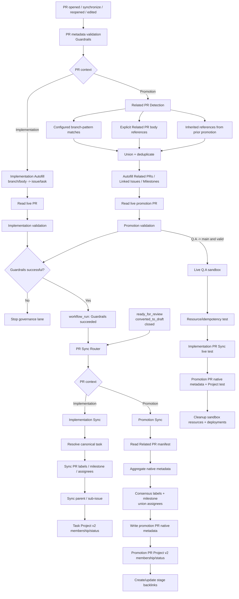

# PR Governance Architecture

## Purpose

This document is the execution contract for pull request governance in GitHub Project Automation (GPA).

The core invariant is:

> **Autofill -> Guardrails -> PR Sync**

PR state is always re-read between mutation and synchronization stages so later jobs do not consume stale webhook payloads.

GPA has two PR contexts:

- **Implementation PR** — one canonical linked issue/task;
- **Promotion PR** — an aggregate manifest of already merged implementation PRs.

## Architecture



## Why the order matters

`pull_request_target` payloads are snapshots. Autofill can update the real PR while the original event still contains the old body. GPA therefore uses this handoff:

1. Autofill mutates the real PR through the GitHub API.
2. Guardrails validates the **live PR**.
3. Successful Guardrails emits a separate `workflow_run`.
4. PR Sync refetches the **live PR** and applies synchronization.

This is the same stale-state failure mode the reference Take Your Pills governance lane solved by serializing guardrails before hygiene.

## Implementation PR flow

```text
implementation branch
  -> branch/body resolution
  -> one canonical issue/task
  -> Linked Issue + Milestone Autofill
  -> Guardrails
  -> Implementation Sync
  -> PR labels / milestone / assignees
  -> task Project v2 lifecycle
```

Existing `Closes #N`, `Fixes #N`, and `Resolves #N` references remain authoritative.

## Promotion PR flow

Configured promotion paths are routing rules, not skip rules.

Committed GPA paths:

```text
develop -> Q.A
Q.A -> main
```

A promotion represents an aggregate of implementation PRs and must never select an arbitrary first task as its source of truth.

### Related PR Detection

The detector unions and deduplicates:

1. merged PRs whose head branches match configured regexes;
2. explicit PR references from configured body sections such as `## Related PRs`;
3. inherited implementation PR references from prior promotion PRs.

Default branch-pattern examples are deliberately broad:

```text
^feat/
^fix/
^docs/
^refactor/
^test/
^hotfix/
^phase/
^task/
^chore/
^ci/
^release/
```

A target repository can replace the entire list through `prAutomation.relatedPrs.branchPatterns`.

### Detection window

For `develop -> Q.A`, automatic discovery starts after the previous merged `develop -> Q.A` promotion.

For `Q.A -> main`, GPA considers promotions merged into `Q.A` after the previous `Q.A -> main` promotion and inherits their constituent implementation PRs. Work that remains only in `develop` is therefore not attributed to `main`.

When no earlier promotion exists, `fallbackDays` bounds the initial lookup. Explicit body references do not depend on that window.

## Promotion Autofill

Promotion Autofill can deterministically populate:

- `## Related PRs`;
- `## Linked Issue` from closing references in the constituent PRs;
- `## Milestone` from constituent PR milestone titles;
- `## Summary` only while that section is still a placeholder.

Human-authored summaries, evidence, risks, test notes, and DoD decisions are preserved.

## Promotion native metadata contract

Promotion Sync treats the **related PR objects** as the aggregate source of truth for GitHub-native PR fields.

### Labels

Only configured managed families are synchronized, by default:

```text
type:
priority:
test:
```

Each family uses **consensus**:

```text
#101 priority:high
#102 priority:high
#103 priority:high
        -> promotion priority:high
```

A disagreement or missing value does not cause GPA to select an arbitrary label. The managed family is omitted from the promotion PR and the conflict is reported in the Promotion Sync sticky comment.

Unmanaged/manual labels are preserved.

### Milestone

Milestone is single-valued and also requires consensus across all related PRs. A unanimous milestone is applied to the promotion PR. Missing/disagreeing milestones clear the synchronized promotion milestone instead of selecting one arbitrarily.

### Assignees

Assignees are naturally multi-valued. Promotion Sync applies the deduplicated union of assignees from all related PRs.

### Project v2

Implementation Sync keeps its existing model: the **linked issue/task** is the Project v2 work item.

Promotion Sync additionally treats the **promotion PR itself** as a Project v2 item because a promotion has an independent review/release lifecycle.

Default lifecycle mapping:

| Promotion PR state | Project Status |
| --- | --- |
| Draft | `In progress` |
| Open / review | `In review` |
| Closed without merge | `In progress` |
| Merged | `Done` |

This is what makes the native `Projects` sidebar field meaningful for promotion PRs when `PROJECT_SETUP_PROJECT_NUMBER` and `PROJECT_SETUP_PAT` are configured.

## Promotion validation

Guardrails verify that:

- the head/base pair is a configured promotion path;
- at least one merged PR is listed in the configured Related PR section;
- every referenced PR is actually merged;
- auto-detected related PRs are not silently omitted.

Promotion PRs use their own contract rather than bypassing validation.

## PR Sync routing

`.github/workflows/pr-sync.yml` invokes `project_setup.pr_sync_router`.

```text
implementation PR -> project_setup.pr_sync
promotion PR      -> project_setup.promotion_sync
```

`project_setup.related_prs` owns discovery, Autofill, and validation. `project_setup.promotion_sync` owns aggregate native metadata, promotion Project membership/status, and backlinks.

## Authentication boundary

Repository-scoped mutations use the built-in Actions token:

```yaml
permissions:
  contents: read
  issues: write
  pull-requests: write
```

This covers PR labels, milestone, assignees, comments, and backlinks.

GitHub Projects v2 uses the optional separate credential:

```text
PROJECT_SETUP_PAT
```

and `PROJECT_SETUP_PROJECT_NUMBER` identifies the target Project. If either is absent, native PR metadata still synchronizes and Project synchronization is reported as skipped.

## Live regression contract

The protected `Q.A -> main` lane must prove all of the following against the disposable sandbox:

```text
Implementation PR Sync
  -> labels present on PR
  -> milestone present on PR
  -> assignee present on PR
  -> linked task in Project v2 / In review
  -> non-default base branch works

Promotion Sync
  -> two real constituent PRs merged into source branch
  -> consensus labels present on promotion PR
  -> consensus milestone present on promotion PR
  -> assignee union present on promotion PR
  -> promotion PR itself in Project v2 / In review
  -> merged promotion PR Project status -> Done
  -> stage backlinks converge to merged

Cleanup
  -> disposable PRs/issues closed
  -> branches removed
  -> Project removed
  -> milestone removed
  -> labels removed
  -> historical Q.A deployments cleaned
```

A sticky comment alone is never sufficient evidence that structured synchronization worked.

## Security invariants

- privileged workflows execute trusted base/default-branch code;
- untrusted PR head code is never executed with write credentials;
- fork PRs are excluded from privileged mutations;
- privileged checkouts use `persist-credentials: false`;
- Guardrails success is required before normal synchronization;
- live PR state is refetched after Autofill;
- conflicts in single-valued promotion metadata are fail-safe rather than guessed;
- Project v2 credentials remain isolated from repository-scoped mutations.
