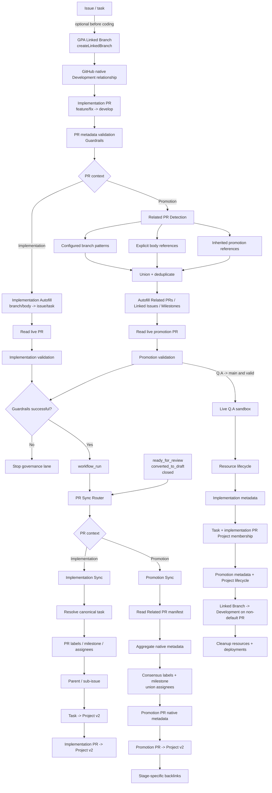

# PR Governance Architecture

## Purpose

This document is the execution contract for pull request governance in GitHub Project Automation (GPA).

The core invariant is:

> **Autofill -> Guardrails -> PR Sync**

PR state is re-read between mutation and synchronization stages so later jobs do not consume stale webhook payloads. GPA has two synchronization contexts: an implementation PR backed by one canonical issue/task, and a promotion PR backed by an aggregate Related PR manifest.

## Architecture



## Why the order matters

`pull_request_target` payloads are snapshots. Autofill can mutate the real PR while the original event still carries the old body. GPA therefore mutates the live PR, validates that live PR, waits for successful Guardrails to emit a separate `workflow_run`, and then refetches the live PR before synchronization.

## Implementation PR contract

Implementation PRs use one canonical issue/task. Existing `Closes #N`, `Fixes #N`, and `Resolves #N` body references remain authoritative for GPA metadata resolution.

The synchronized native state is:

```text
canonical task
  -> PR labels / milestone / assignees
  -> parent/sub-issue relationship
  -> task Project v2 lifecycle
  -> implementation PR Project v2 lifecycle
```

Both task and PR use the configured lifecycle mapping. This intentionally makes the PR visible in GitHub's native `Projects` sidebar instead of tracking only the issue.

### Native Development relationship

Closing keywords have a GitHub limitation: they create native issue links only when the PR targets the default branch. GPA's implementation lane normally targets `develop`, so the body reference is sufficient for GPA but not for GitHub's Development sidebar.

GPA therefore supports GitHub Linked Branches as the native Development path:

```text
issue
  -> project_setup.linked_branch createLinkedBranch
  -> implementation branch linked to issue
  -> open PR from that branch to develop
  -> GitHub transfers branch relationship to PR
  -> Development sidebar shows the PR
```

Branch naming is caller-controlled and independent of `US-*`; repositories can continue using `feat/`, `fix/`, `task/`, or their own convention. Existing ordinary PRs must be linked manually in GitHub because the public API creates a new Linked Branch rather than retroactively converting an existing branch.

## Promotion PR contract

Configured promotion paths are routing rules, not skip rules:

```text
develop -> Q.A
Q.A -> main
```

A promotion represents a set of implementation PRs and never selects an arbitrary first task as its source of truth.

### Related PR Detection

The detector unions and deduplicates merged PRs matched by configured branch regexes, explicit references from configured body sections, and inherited references from prior promotions. Default branch-pattern examples are broad (`feat/`, `fix/`, `docs/`, `refactor/`, `test/`, `hotfix/`, `phase/`, `task/`, `chore/`, `ci/`, `release/`) and are replaceable through configuration.

For `develop -> Q.A`, automatic discovery starts after the previous merged promotion of the same path. For `Q.A -> main`, GPA inherits constituent implementation PRs from promotions that actually reached Q.A so work remaining only in `develop` is not attributed to `main`.

### Promotion native metadata

Promotion Sync treats Related PR objects as the aggregate source of truth:

- configured managed label families use consensus;
- milestone requires unanimous agreement;
- assignees use a deduplicated union;
- unmanaged labels are preserved;
- conflicts are reported rather than guessed;
- the promotion PR itself is a Project v2 item;
- stage-specific backlinks remain idempotent.

## Project v2 contract

Default lifecycle mapping:

| PR state | Project Status |
| --- | --- |
| Draft | `In progress` |
| Open / review | `In review` |
| Closed without merge | `In progress` |
| Merged | `Done` |

Project operations use `PROJECT_SETUP_PAT`. Target Project resolution is deterministic:

```text
explicit --project-number
        ↓ otherwise
PROJECT_SETUP_PROJECT_NUMBER
        ↓ otherwise, when PAT exists
unique exact title == projectDefinitionFile.name
        ↓
zero matches -> skip with diagnostic
multiple matches -> fail, never guess
```

Repository-scoped synchronization continues when Project configuration is unavailable.

## Authentication boundary

Repository-scoped PR/issue mutations use `${{ github.token }}` with narrowly scoped workflow permissions. GitHub Projects v2 uses `PROJECT_SETUP_PAT`. Explicit local/live Linked Branch creation also requires credentials with repository write access because it creates a real branch through GitHub GraphQL.

Privileged workflows execute trusted base/default-branch code, exclude forks from privileged mutations, and use `persist-credentials: false` on trusted checkouts.

## Live regression contract

The protected `Q.A -> main` lane is fail-closed and must prove native state, not comments:

```text
Implementation metadata
  -> labels / milestone / assignee on PR
  -> non-default base works

Implementation Project lifecycle
  -> linked task in Project / In review
  -> implementation PR itself in Project / In review

Promotion lifecycle
  -> real merged constituent PRs
  -> consensus native metadata on promotion PR
  -> promotion PR in Project / In review
  -> merged promotion -> Done
  -> backlinks converge

Development linkage
  -> issue-linked branch created through createLinkedBranch
  -> PR opened against non-default base
  -> PR appears in issue's user-linked Development references

Cleanup
  -> disposable PRs/issues closed
  -> branches, Project, milestone and labels removed
  -> historical Q.A deployments cleaned
```

A sticky status comment alone is never accepted as proof of structured synchronization.
