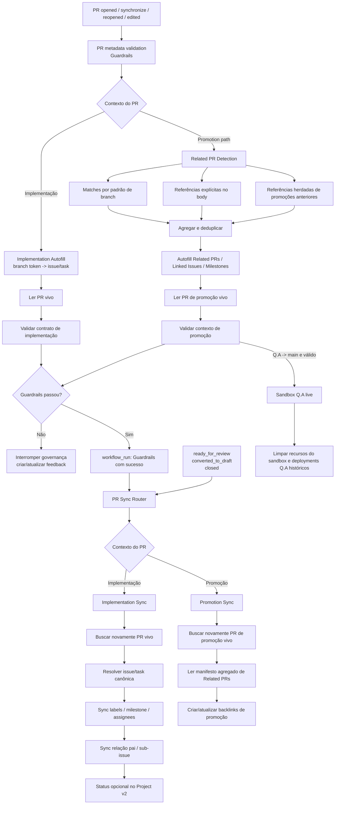

# Arquitetura de Governança de PR

## Objetivo

Este documento é o contrato de execução da governança de pull requests no GitHub Project Automation (GPA).

O comportamento de referência vem do fluxo comprovado no Take Your Pills, mas o GPA generaliza a lógica específica de release para um mecanismo configurável de **Related PR Detection**.

A regra principal continua sendo:

> **Autofill -> Guardrails -> PR Sync**

A diferença é que Autofill e PR Sync agora são roteados conforme o contexto:

- PRs de implementação usam uma issue/task canônica;
- PRs de promoção usam um conjunto agregado de PRs relacionados.

## Arquitetura



## Por que a ordem importa

Payloads de `pull_request_target` são snapshots. Se o Autofill altera o body do PR e uma etapa seguinte usa o payload original, ela pode consumir metadata antiga.

A passagem segura é:

1. Autofill altera o pull request real pela API do GitHub.
2. Guardrails valida o **PR vivo**.
3. O sucesso do Guardrails gera um novo evento `workflow_run`.
4. PR Sync busca novamente o **PR vivo** antes de sincronizar.

Esse é o mesmo aprendizado arquitetural usado no Take Your Pills após o problema de stale state entre automações independentes.

## Fluxo de PR de implementação

PRs de implementação preservam o modelo determinístico:

```text
branch
  -> token explícito de issue/task ou mapeamento configurado
  -> uma issue/task canônica
  -> Linked Issue + Milestone
  -> Guardrails
  -> PR Sync
```

Referências já informadas como `Closes #123`, `Fixes #123` ou `Resolves #123` continuam sendo autoritativas.

## Fluxo de PR de promoção

`promotionPaths` passam a ser **regras de roteamento**, não regras de skip.

Os caminhos configurados no GPA são:

```text
develop -> Q.A
Q.A -> main
```

Uma promoção recebe um contexto agregado em vez de uma falsa task única.

### Related PR Detection

O GPA combina dois mecanismos primários de descoberta e um de propagação:

1. **Padrão de branch** — PRs mergeados na branch-fonte da promoção cujo head corresponde a um regex configurado.
2. **Referência no body** — números de PR explicitamente listados em seções configuradas, como `## Related PRs`.
3. **Referência herdada** — uma promoção posterior pode herdar os Related PRs declarados por uma promoção anterior que foi mergeada na sua branch-fonte.

Os resultados são unidos e deduplicados.

Os padrões default são propositalmente amplos como exemplos:

```text
^feat/
^fix/
^docs/
^refactor/
^test/
^hotfix/
^phase/
^task/
^chore/
^ci/
^release/
```

Eles são configuração, não uma limitação do engine. Um repositório pode substituir a lista inteira, por exemplo:

```json
{
  "prAutomation": {
    "relatedPrs": {
      "branchPatterns": ["^work/", "^bug/"]
    }
  }
}
```

Referências explícitas no body continuam funcionando mesmo quando a branch do PR referenciado não corresponde a nenhum pattern configurado.

### Janela de detecção

Para `develop -> Q.A`, a autodetecção considera PRs mergeados em `develop` depois da última promoção `develop -> Q.A` mergeada.

Para `Q.A -> main`, a autodetecção considera PRs mergeados em `Q.A` depois da última promoção `Q.A -> main`. Quando esses PRs-fonte são promoções, suas seções `Related PRs` são herdadas, garantindo que apenas trabalho que já chegou em Q.A seja propagado para `main`.

Se ainda não existir promoção anterior, `fallbackDays` define uma janela inicial limitada. O default versionado é sete dias. Referências explícitas no body não dependem dessa janela automática.

## Contrato do Promotion Autofill

Em PRs de promoção, o detector pode preencher deterministicamente:

- `## Related PRs` com os PRs detectados;
- `## Linked Issue` com as closing references existentes nos PRs relacionados;
- `## Milestone` com os milestones únicos desses PRs;
- `## Summary` somente enquanto a seção ainda for placeholder.

Resumo escrito por humano, riscos, evidências, instruções de teste e decisões de DoD são preservados.

## Contrato de validação de promoção

Guardrails de promoção verificam que:

- o par head/base é um `promotionPath` configurado;
- existe pelo menos um PR mergeado na seção Related PR configurada;
- os PRs referenciados realmente estão mergeados;
- PRs relacionados autodetectados não foram silenciosamente omitidos.

Portanto, promotion PR não significa mais “pular validação”. Ele usa um contrato de validação próprio.

## Roteamento do PR Sync

`.github/workflows/pr-sync.yml` executa `project_setup.pr_sync_router`.

O router escolhe exatamente um modo:

```text
PR de implementação -> project_setup.pr_sync
PR de promoção      -> project_setup.related_prs Promotion Sync
```

Implementation Sync continua responsável por metadata derivada da task, vínculo pai/sub-issue e lifecycle opcional no Project v2.

Promotion Sync é responsável pelo manifesto agregado e pelos backlinks idempotentes de cada PR relacionado para a promoção. Ele não copia metadata de uma “primeira issue” arbitrária.

## Responsabilidades dos workflows

### `.github/workflows/pr-metadata.yml` — Guardrails

Ordem interna:

1. Checkout da base confiável.
2. Executar Related PR Autofill quando for promoção.
3. Executar Implementation Autofill quando for implementação.
4. Validar o contrato do PR vivo de implementação.
5. Validar o contexto vivo de promoção quando aplicável.
6. Para `Q.A -> main` válido, executar Q.A live e cleanup.

### `.github/workflows/pr-sync.yml` — Sync/Hygiene

Sincronização normal é acionada por:

```text
workflow_run(PR metadata validation = success)
```

Eventos diretos de lifecycle continuam:

- `ready_for_review`;
- `converted_to_draft`;
- `closed`.

O router consome estado vivo pelo caminho de implementação ou promoção conforme necessário.

## Configuração

O contrato de Related PR fica em `prAutomation.relatedPrs`:

```json
{
  "prAutomation": {
    "relatedPrs": {
      "enabled": true,
      "branchPatterns": [
        "^feat/",
        "^fix/",
        "^docs/",
        "^refactor/",
        "^test/",
        "^hotfix/",
        "^phase/",
        "^task/",
        "^chore/",
        "^ci/",
        "^release/"
      ],
      "bodySections": ["Related PRs", "Related Pull Requests"],
      "includeBranchMatches": true,
      "includeBodyReferences": true,
      "inheritBodyReferences": true,
      "fallbackDays": 7
    },
    "sync": {
      "promotionPaths": [
        {"head": "develop", "base": "Q.A"},
        {"head": "Q.A", "base": "main"}
      ]
    }
  }
}
```

Não existe mais um switch de skip de promoção na configuração versionada. `promotionPaths` seleciona o modo de promoção.

## Fronteira de autenticação

Operações de PR/issue dentro do repositório usam:

```text
github.token
```

Os workflows relevantes solicitam:

```yaml
permissions:
  contents: read
  issues: write
  pull-requests: write
```

`PROJECT_SETUP_PAT` continua opcional e separado exclusivamente para GitHub Projects v2. Related PR Detection e Promotion Sync não dependem desse PAT.

## Invariantes de segurança

- Automação privilegiada executa código confiável da base/default branch.
- Código do head não é executado com credenciais de escrita pelo fluxo de governança.
- Forks permanecem excluídos das mutações privilegiadas.
- `persist-credentials` permanece desabilitado.
- Guardrails precisa passar antes do PR Sync normal.
- PR Sync precisa consumir estado vivo depois do Guardrails.
- Promotion paths são roteados para sincronização agregada em vez de mutação de task de implementação.
- Related PRs explícitos são verificados como PRs realmente mergeados.
- Credenciais de Project v2 permanecem isoladas.

## Contrato de regressão

Um PR de implementação novo deve convergir sem exigir um segundo evento:

```text
Implementation Autofill
  -> validar PR vivo
  -> workflow_run
  -> buscar PR vivo
  -> Implementation Sync
```

Um PR de promoção deve convergir sem inventar uma task única:

```text
Related PR Detection
  -> Autofill agregado do body
  -> validar contexto vivo de promoção
  -> workflow_run
  -> Promotion Sync
  -> backlinks
```

Tanto pattern de branch quanto referência explícita no body são entradas de primeira classe, e os patterns precisam permanecer substituíveis por configuração.
