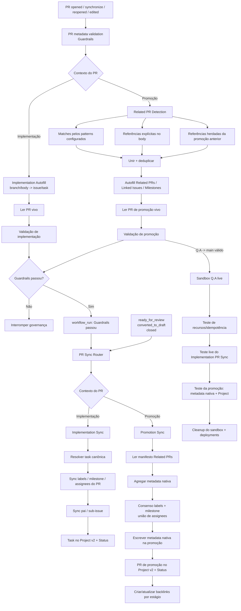

# Arquitetura de Governança de PR

## Objetivo

Este documento é o contrato de execução da governança de pull requests no GitHub Project Automation (GPA).

A regra central é:

> **Autofill -> Guardrails -> PR Sync**

O estado do PR sempre é lido novamente entre etapas de mutação e sincronização, evitando consumo de payload antigo do webhook.

O GPA possui dois contextos:

- **PR de implementação** — uma issue/task canônica;
- **PR de promoção** — um manifesto agregado de PRs de implementação já mergeados.

## Arquitetura



## Por que a ordem importa

Payloads de `pull_request_target` são snapshots. O Autofill pode alterar o PR real enquanto o evento original continua com o body anterior. Por isso o GPA usa a seguinte passagem:

1. Autofill altera o PR real pela API do GitHub.
2. Guardrails valida o **PR vivo**.
3. Guardrails bem-sucedido gera um `workflow_run` separado.
4. PR Sync busca novamente o **PR vivo** antes de sincronizar.

Esse é o mesmo tipo de stale state resolvido pelo fluxo de governança do Take Your Pills ao serializar guardrails antes de hygiene.

## Fluxo de implementação

```text
branch de implementação
  -> resolução por branch/body
  -> uma issue/task canônica
  -> Autofill Linked Issue + Milestone
  -> Guardrails
  -> Implementation Sync
  -> labels / milestone / assignees no PR
  -> lifecycle da task no Project v2
```

`Closes #N`, `Fixes #N` e `Resolves #N` já existentes continuam autoritativos.

## Fluxo de promoção

`promotionPaths` são regras de roteamento, não regras de skip.

Caminhos versionados:

```text
develop -> Q.A
Q.A -> main
```

Uma promoção representa um agregado de PRs de implementação e nunca deve escolher uma “primeira task” arbitrária como fonte de verdade.

### Related PR Detection

O detector une e deduplica:

1. PRs mergeados cujas branches de origem correspondem aos regex configurados;
2. referências explícitas em seções como `## Related PRs`;
3. referências de implementação herdadas de uma promoção anterior.

Patterns default propositalmente amplos:

```text
^feat/
^fix/
^docs/
^refactor/
^test/
^hotfix/
^phase/
^task/
^chore/
^ci/
^release/
```

O repositório de destino pode substituir a lista inteira via `prAutomation.relatedPrs.branchPatterns`.

### Janela de detecção

Em `develop -> Q.A`, a autodetecção começa depois da última promoção `develop -> Q.A` mergeada.

Em `Q.A -> main`, o GPA considera promoções mergeadas em `Q.A` depois da última `Q.A -> main` e herda os PRs de implementação dessas promoções. Trabalho que ficou somente em `develop` não é atribuído ao `main`.

Sem promoção anterior, `fallbackDays` limita a primeira busca. Referências explícitas no body não dependem dessa janela.

## Promotion Autofill

O Autofill de promoção pode preencher deterministicamente:

- `## Related PRs`;
- `## Linked Issue` a partir das closing references dos PRs constituintes;
- `## Milestone` com os milestones dos PRs constituintes;
- `## Summary` somente enquanto a seção ainda for placeholder.

Resumo, evidências, riscos, testes e DoD escritos por humano são preservados.

## Contrato de metadata nativa da promoção

Promotion Sync usa os **objetos dos Related PRs** como fonte agregada para os campos nativos do PR de promoção.

### Labels

Somente famílias gerenciadas são sincronizadas. Default:

```text
type:
priority:
test:
```

Cada família exige **consenso**:

```text
#101 priority:high
#102 priority:high
#103 priority:high
        -> promoção priority:high
```

Se houver divergência ou ausência, o GPA não escolhe um valor arbitrário. A família gerenciada é omitida do PR de promoção e o conflito aparece no comentário sticky do Promotion Sync.

Labels manuais/não gerenciadas são preservadas.

### Milestone

Milestone também é single-value e exige consenso. Um único milestone unânime é aplicado à promoção. Ausência/divergência remove o milestone sincronizado em vez de escolher um aleatoriamente.

### Assignees

Assignees são multi-value. Promotion Sync aplica a união deduplicada dos assignees dos Related PRs.

### Project v2

Implementation Sync mantém o comportamento atual: a **issue/task vinculada** é o item de trabalho no Project v2.

Promotion Sync passa a adicionar também o **próprio PR de promoção** ao Project v2, porque a promoção possui lifecycle independente de review/release.

Mapeamento default:

| Estado da promoção | Project Status |
| --- | --- |
| Draft | `In progress` |
| Open / review | `In review` |
| Fechado sem merge | `In progress` |
| Mergeado | `Done` |

Isso é o que torna o campo nativo `Projects` do sidebar significativo para PRs de promoção quando `PROJECT_SETUP_PROJECT_NUMBER` e `PROJECT_SETUP_PAT` estão configurados.

## Validação de promoção

Guardrails verifica que:

- head/base formam um `promotionPath` configurado;
- existe pelo menos um PR mergeado na seção Related PR;
- todos os PRs referenciados realmente foram mergeados;
- Related PRs autodetectados não foram omitidos silenciosamente.

Promoção possui contrato próprio; não é bypass de validação.

## Roteamento do PR Sync

`.github/workflows/pr-sync.yml` executa `project_setup.pr_sync_router`.

```text
PR de implementação -> project_setup.pr_sync
PR de promoção      -> project_setup.promotion_sync
```

`project_setup.related_prs` cuida de detecção, Autofill e validação. `project_setup.promotion_sync` cuida de metadata nativa agregada, membership/status da promoção no Project e backlinks.

## Fronteira de autenticação

Mutações dentro do repositório usam o token nativo do Actions:

```yaml
permissions:
  contents: read
  issues: write
  pull-requests: write
```

Isso cobre labels, milestone, assignees, comentários e backlinks.

Projects v2 usa a credencial separada opcional:

```text
PROJECT_SETUP_PAT
```

`PROJECT_SETUP_PROJECT_NUMBER` identifica o Project. Sem um deles, a metadata nativa do PR continua funcionando e apenas a sincronização do Project é reportada como skipped.

## Contrato de regressão live

O lane protegido `Q.A -> main` precisa provar no sandbox descartável:

```text
Implementation PR Sync
  -> labels presentes no PR
  -> milestone presente no PR
  -> assignee presente no PR
  -> task vinculada no Project v2 / In review
  -> base não-default funciona

Promotion Sync
  -> dois PRs constituintes reais mergeados na branch-fonte
  -> labels por consenso no PR de promoção
  -> milestone por consenso no PR de promoção
  -> união de assignees no PR de promoção
  -> próprio PR de promoção no Project v2 / In review
  -> após merge, Status do PR de promoção -> Done
  -> backlinks convergem para merged

Cleanup
  -> PRs/issues descartáveis fechados
  -> branches removidas
  -> Project removido
  -> milestone removido
  -> labels removidas
  -> deployments Q.A históricos limpos
```

Um comentário sticky isolado nunca é evidência suficiente de que a sincronização estruturada funcionou.

## Invariantes de segurança

- workflows privilegiados executam código confiável da base/default branch;
- código não confiável do head não roda com credenciais de escrita;
- forks são excluídos das mutações privilegiadas;
- checkouts privilegiados usam `persist-credentials: false`;
- Guardrails precisa passar antes do Sync normal;
- o PR vivo é lido novamente depois do Autofill;
- conflitos de metadata single-value são tratados de forma fail-safe, sem chute;
- credenciais de Project v2 continuam isoladas das mutações normais do repositório.
