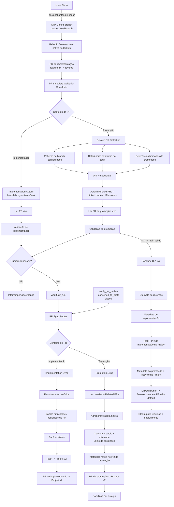

# Arquitetura de Governança de PR

## Objetivo

Este documento é o contrato de execução da governança de pull requests no GitHub Project Automation (GPA).

A regra central é:

> **Autofill -> Guardrails -> PR Sync**

O estado do PR é relido entre etapas de mutação e sincronização para evitar stale state. O GPA possui dois contextos: PR de implementação com uma issue/task canônica e PR de promoção com manifesto agregado de Related PRs.

## Arquitetura



## Por que a ordem importa

Payloads de `pull_request_target` são snapshots. O Autofill pode alterar o PR real enquanto o evento original mantém o body anterior. O GPA altera o PR vivo, valida esse estado, aguarda um `workflow_run` de Guardrails bem-sucedido e então busca novamente o PR antes do Sync.

## Contrato de PR de implementação

PRs de implementação usam uma issue/task canônica. `Closes #N`, `Fixes #N` e `Resolves #N` continuam autoritativos para a resolução interna do GPA.

Estado nativo sincronizado:

```text
task canônica
  -> labels / milestone / assignees no PR
  -> relação pai/sub-issue
  -> lifecycle da task no Project v2
  -> lifecycle do próprio PR de implementação no Project v2
```

Task e PR usam o mesmo mapeamento de lifecycle. Isso faz o PR aparecer no campo nativo `Projects`, em vez de manter somente a issue no board.

### Relação Development nativa

Closing keywords do GitHub criam vínculo nativo apenas quando o PR aponta para a branch default. Como o lane de implementação do GPA normalmente aponta para `develop`, a referência do body é suficiente para o GPA, mas não para o sidebar Development.

O caminho nativo suportado pelo GPA usa Linked Branch:

```text
issue
  -> project_setup.linked_branch / createLinkedBranch
  -> branch de implementação vinculada à issue
  -> abrir PR dessa branch para develop
  -> GitHub transfere o vínculo da branch para o PR
  -> Development mostra o PR
```

O nome da branch é definido por quem configura o repositório; não depende de `US-*`. Branches `feat/`, `fix/`, `task/` ou qualquer convenção escolhida continuam válidas. PRs comuns já existentes precisam ser vinculados manualmente pelo GitHub porque a API pública cria uma nova Linked Branch em vez de converter uma branch existente.

## Contrato de promoção

`promotionPaths` são regras de roteamento, não skip:

```text
develop -> Q.A
Q.A -> main
```

Uma promoção representa um conjunto de PRs de implementação e nunca escolhe uma primeira task arbitrária.

### Related PR Detection

O detector une/deduplica PRs mergeados encontrados pelos regex configurados, referências explícitas do body e referências herdadas de promoções anteriores. Os patterns default (`feat/`, `fix/`, `docs/`, `refactor/`, `test/`, `hotfix/`, `phase/`, `task/`, `chore/`, `ci/`, `release/`) são exemplos amplos e substituíveis.

Para `develop -> Q.A`, a busca automática começa depois da última promoção equivalente mergeada. Para `Q.A -> main`, o GPA herda somente os PRs constituintes das promoções que realmente chegaram em Q.A, evitando atribuir ao main trabalho que permaneceu apenas em develop.

### Metadata nativa de promoção

Promotion Sync usa os objetos dos Related PRs como fonte agregada:

- famílias de labels gerenciadas exigem consenso;
- milestone exige unanimidade;
- assignees usam união deduplicada;
- labels externas são preservadas;
- conflitos são reportados, não adivinhados;
- o próprio PR de promoção é item do Project v2;
- backlinks por estágio são idempotentes.

## Contrato do Project v2

Lifecycle padrão:

| Estado do PR | Project Status |
| --- | --- |
| Draft | `In progress` |
| Open / review | `In review` |
| Fechado sem merge | `In progress` |
| Mergeado | `Done` |

Operações de Project usam `PROJECT_SETUP_PAT`. A resolução do board é determinística:

```text
--project-number explícito
        ↓ senão
PROJECT_SETUP_PROJECT_NUMBER
        ↓ senão, se houver PAT
nome exato único == projectDefinitionFile.name
        ↓
zero matches -> skip com diagnóstico
mais de um -> falha, nunca escolhe por chute
```

A sincronização restrita ao repositório continua funcionando quando Project não está disponível.

## Fronteira de autenticação

Mutações normais de PR/issue usam `${{ github.token }}` com permissões restritas. Projects v2 usa `PROJECT_SETUP_PAT`. A criação explícita local/live de Linked Branch também precisa de credencial com escrita no repositório, pois cria uma branch real pela API GraphQL do GitHub.

Workflows privilegiados executam código confiável da base/default, excluem forks das mutações privilegiadas e usam `persist-credentials: false`.

## Contrato de regressão live

O lane protegido `Q.A -> main` precisa provar estado nativo, não comentários:

```text
Metadata de implementação
  -> labels / milestone / assignee no PR
  -> base não-default funciona

Lifecycle de Project da implementação
  -> task vinculada no Project / In review
  -> próprio PR de implementação no Project / In review

Lifecycle de promoção
  -> PRs constituintes reais mergeados
  -> metadata por consenso no PR de promoção
  -> PR de promoção no Project / In review
  -> promoção mergeada -> Done
  -> backlinks convergem

Development
  -> branch criada com createLinkedBranch
  -> PR aberto contra base não-default
  -> PR aparece nas referências Development user-linked da issue

Cleanup
  -> PRs/issues descartáveis fechados
  -> branches, Project, milestone e labels removidos
  -> deployments históricos de Q.A limpos
```

Comentário sticky isolado nunca é aceito como prova da sincronização estruturada.
