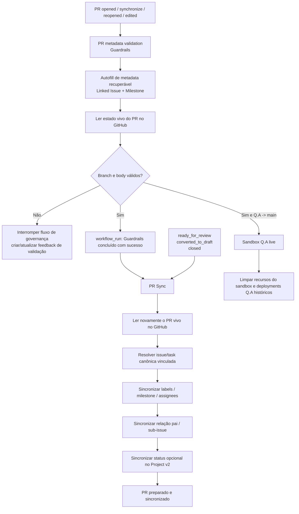

# Arquitetura de Governança de PR

## Objetivo

Este documento é o contrato de execução da governança de pull requests no GitHub Project Automation (GPA).

O comportamento de referência vem do fluxo já comprovado no Take Your Pills. A regra principal é a ordem entre as etapas que alteram e consomem o estado do PR:

> **Autofill -> Guardrails -> PR Sync**

PR Sync é o sucessor genérico no GPA da etapa chamada PR Hygiene no repositório de referência. Autofill não faz parte da execução do PR Sync; ele prepara o PR dentro do Guardrails.

## Arquitetura



## Por que a ordem importa

Payloads de `pull_request_target` são snapshots. Se o Autofill altera o body de um PR e uma etapa de sincronização logo depois usa o payload original do evento, essa etapa pode consumir metadata antiga.

Por isso o GPA não usa o body do evento original como mecanismo de passagem de estado entre Autofill e PR Sync.

A passagem segura é:

1. Autofill altera o pull request real pela API do GitHub.
2. Guardrails valida o **PR vivo** obtido do GitHub.
3. O sucesso do Guardrails gera um evento separado de `workflow_run`.
4. PR Sync obtém o número do PR associado e busca novamente o **PR vivo** antes da sincronização.

Essa é a mesma correção arquitetural adotada no Take Your Pills depois que o repositório de referência encontrou consumo de estado antigo do PR entre workflows de governança.

## Responsabilidades dos workflows

### `.github/workflows/pr-metadata.yml` — papel de Guardrails

É acionado diretamente por eventos confiáveis de `pull_request_target`:

- `opened`;
- `synchronize`;
- `reopened`;
- `edited`.

Ordem interna:

1. Checkout do commit confiável da base.
2. Executar `project_setup.pr_autofill`.
3. Executar `scripts/validation/validate_pr_body.py`.
4. O validator consulta o PR vivo pela API quando repository e número do PR estão disponíveis.
5. Para uma promoção válida `Q.A -> main`, executar o sandbox live de Q.A e o fluxo de limpeza.

Guardrails é responsável por validação. Ele não sincroniza metadata derivada da task para o PR.

### `.github/workflows/pr-sync.yml` — papel de Sync/Hygiene

A sincronização normal de implementação só é acionada por:

```text
workflow_run(PR metadata validation = success)
```

O tratamento direto por `pull_request_target` fica limitado aos eventos de ciclo de vida que precisam atualizar estado sem repetir a validação de implementação:

- `ready_for_review`;
- `converted_to_draft`;
- `closed`.

Quando recebe `workflow_run`, `project_setup.pr_sync` reconstrói o contexto buscando o pull request associado diretamente no GitHub. Ele não deve consumir um body antigo herdado do webhook original.

PR Sync é responsável por:

- resolver a issue/task de implementação vinculada;
- sincronizar as famílias configuradas de labels;
- sincronizar milestone;
- sincronizar assignees;
- sincronizar relação pai/sub-issue;
- sincronizar opcionalmente membership/status do Project v2;
- manter o comentário marcado de status do PR Sync.

## PRs de promoção

Mutações relacionadas à task de implementação são ignoradas nos caminhos de promoção configurados. Os padrões do GPA são:

```text
develop -> Q.A
Q.A -> main
```

Esses PRs ainda podem passar pelo Guardrails e participar de validações específicas de promoção, como Q.A live, mas PR Sync não deve inventar nem exigir uma task de implementação para eles.

## Fronteira de autenticação

Operações de PR/issues restritas ao repositório usam o token nativo do Actions:

```text
github.token
```

Os workflows relevantes solicitam:

```yaml
permissions:
  contents: read
  issues: write
  pull-requests: write
```

Esse token é usado para alteração do body do PR, comentários, labels, milestones, assignees e relações de issues dentro do repositório.

`PROJECT_SETUP_PAT` é uma fronteira separada e opcional destinada às operações de GitHub Projects v2. A ausência das credenciais do Project não deve impedir a sincronização normal de PR/issues.

## Invariantes de segurança

- A automação privilegiada executa código da base/default branch confiável.
- O código do head do PR nunca é executado com credenciais de escrita pelo fluxo de governança.
- PRs de forks são ignorados nas mutações privilegiadas.
- `persist-credentials` permanece desabilitado nos checkouts confiáveis.
- Guardrails precisa passar antes da execução normal do PR Sync.
- PR Sync normal precisa buscar novamente o estado vivo do PR após Guardrails.
- Exceções de PRs de promoção são avaliadas antes de qualquer mutação de task de implementação.
- Credenciais do Project v2 permanecem separadas das mutações comuns do repositório.

## Contrato de regressão

Um PR de implementação recém-aberto, com branch resolvível de forma determinística, pode começar com placeholders em Linked Issue/Milestone. Sem edição manual, rerun ou segundo commit, a automação deve convergir para:

```text
Autofill no PR vivo
  -> validar PR vivo
  -> workflow_run com sucesso
  -> buscar novamente o PR vivo
  -> PR Sync
```

Se Guardrails falhar, o PR Sync normal não deve executar.

Os testes de contrato em `tests/test_pr_sync.py` e `tests/test_pr_sync_autofill.py` protegem essa ordem e o comportamento de refetch do estado vivo.
