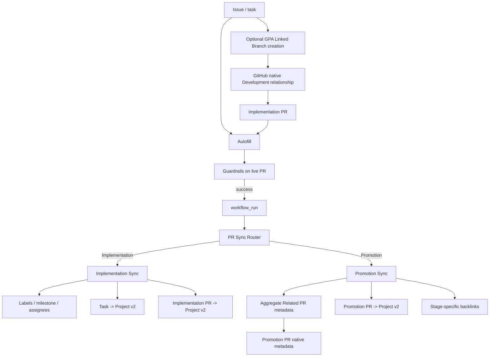

# PR Sync

## Status

**Implemented.**

PR Sync is GPA's post-Guardrails synchronization lane. The public workflow is `.github/workflows/pr-sync.yml`; `project_setup.pr_sync_router` selects one of two modes:

```text
Implementation PR -> project_setup.pr_sync + PR Project membership
Promotion PR      -> project_setup.promotion_sync
```

Normal synchronization runs only after successful Guardrails through `workflow_run`, and each path refetches live PR state instead of relying on an Autofill-mutated webhook payload.

## Architecture



Lifecycle events that need a direct transition also enter the router: `ready_for_review`, `converted_to_draft`, and `closed`.

## Implementation Sync

Implementation PRs identify one canonical linked issue/task with `Closes #123`, `Fixes #123`, or `Resolves #123`. The task drives configured PR label families, milestone, assignees, parent/sub-issue linkage, and task Project v2 membership/status.

When Project v2 is enabled, **both the linked task and the implementation PR itself are Project items**. This makes the PR's native `Projects` sidebar reflect the same review lifecycle instead of only tracking the task.

Default lifecycle:

| PR state | Project status |
| --- | --- |
| Draft | `In progress` |
| Open / review | `In review` |
| Closed without merge | `In progress` |
| Merged | `Done` |

## Native Development relationship on non-default branches

GitHub interprets closing keywords as native issue links only when the PR targets the repository default branch. GPA's normal implementation lane targets `develop`, so `Closes #123` remains the canonical GPA metadata reference but cannot by itself populate GitHub's `Development` sidebar.

For native Development linkage, create the implementation branch as a GitHub **Linked Branch** before opening the PR:

```bash
python -m project_setup.linked_branch \
  --repo owner/repository \
  --issue 123 \
  --branch feat/issue-123-example \
  --base develop \
  --live
```

The branch name is caller-controlled; GPA does not require `US-*` or any single naming convention. GitHub transfers the Linked Branch relationship to the pull request when that branch is used to open a PR, including a PR whose base is not the default branch.

An already-created ordinary branch/PR cannot be retroactively converted into a Linked Branch through this helper; use GitHub's manual Development-link UI for an existing PR.

## Promotion Sync

Promotion paths are not skipped. Committed paths are:

```text
develop -> Q.A
Q.A -> main
```

Promotion Sync reads the validated `## Related PRs` manifest and never selects a first issue as a fake canonical task. It:

1. aggregates GitHub-native metadata from all constituent PRs;
2. applies consensus labels/milestone and unioned assignees to the promotion PR;
3. adds/updates the promotion PR itself in Project v2;
4. maintains stage-specific backlinks on constituent PRs.

Managed label families use consensus; defaults are `type:`, `priority:`, and `test:`. A missing/conflicting value is reported rather than guessed. Milestone also requires unanimous agreement. Assignees are a deduplicated union.

## Project v2 resolution

Project operations require `PROJECT_SETUP_PAT`. GPA resolves the target board in this order:

1. explicit `--project-number`;
2. `PROJECT_SETUP_PROJECT_NUMBER`;
3. if a Project PAT exists, exact unique title match using the `name` in `projectDefinitionFile`.

If title discovery finds zero projects, GPA skips Project mutation with an explicit diagnostic. If multiple Projects share the configured title, GPA fails rather than choosing one arbitrarily. This makes `PROJECT_SETUP_PROJECT_NUMBER` optional when the configured board already exists with a unique name.

Repository-scoped labels, milestone, assignees, Related PRs, and backlinks continue to work when Project configuration is absent.

## Related PR Detection

`project_setup.related_prs` owns promotion discovery, Autofill, and validation. It unions and deduplicates merged PRs whose head branches match configured regexes, explicit body references, and references inherited from earlier promotions.

Default branch-pattern examples are intentionally broad and fully replaceable:

```text
^feat/
^fix/
^docs/
^refactor/
^test/
^hotfix/
^phase/
^task/
^chore/
^ci/
^release/
```

## Configuration

```json
{
  "prAutomation": {
    "relatedPrs": {
      "enabled": true,
      "branchPatterns": [
        "^feat/", "^fix/", "^docs/", "^refactor/", "^test/",
        "^hotfix/", "^phase/", "^task/", "^chore/", "^ci/", "^release/"
      ],
      "bodySections": ["Related PRs", "Related Pull Requests"],
      "includeBranchMatches": true,
      "includeBodyReferences": true,
      "inheritBodyReferences": true,
      "fallbackDays": 7
    },
    "sync": {
      "enabled": true,
      "syncLabels": true,
      "labelPrefixes": ["type:", "priority:", "test:"],
      "syncMilestone": true,
      "syncAssignees": true,
      "assignAuthorWhenTaskUnassigned": true,
      "linkSubissues": true,
      "syncProject": true,
      "promotionPaths": [
        {"head": "develop", "base": "Q.A"},
        {"head": "Q.A", "base": "main"}
      ],
      "projectStatusField": "Status",
      "projectStatus": {
        "draft": "In progress",
        "review": "In review",
        "closed": "In progress",
        "merged": "Done"
      }
    }
  }
}
```

## Authentication and security

Repository-scoped synchronization uses `${{ github.token }}`. `PROJECT_SETUP_PAT` is reserved for Projects v2 and for explicit local/live operations that require user-scoped GitHub capabilities such as creating Linked Branches.

Privileged Actions continue to run trusted base/default-branch code; untrusted PR head code is never executed with write credentials.

## Live validation

The protected `Q.A -> main` lane now verifies:

1. disposable GitHub resource lifecycle;
2. implementation metadata on a non-default base;
3. **linked task and implementation PR** Project v2 membership/status;
4. promotion PR native metadata and Project lifecycle;
5. a real Linked Branch becoming a native Development-linked PR against a non-default base;
6. complete cleanup.

A sticky comment alone is never sufficient evidence: the tests re-read the native GitHub objects/Project state.

See `pr-governance-architecture.md` for the overall governance model.
