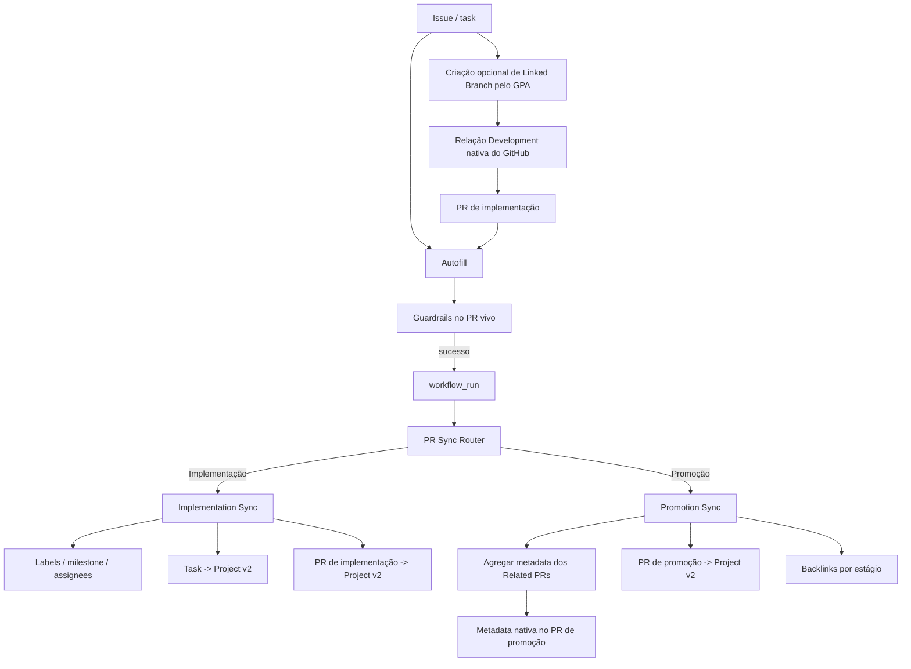

# PR Sync

## Status

**Implementado.**

PR Sync é o lane de sincronização pós-Guardrails do GPA. O workflow público é `.github/workflows/pr-sync.yml`; `project_setup.pr_sync_router` escolhe entre:

```text
PR de implementação -> project_setup.pr_sync + membership do PR no Project
PR de promoção      -> project_setup.promotion_sync
```

A sincronização normal ocorre somente após Guardrails bem-sucedido via `workflow_run`, sempre relendo o PR vivo.

## Arquitetura



Eventos `ready_for_review`, `converted_to_draft` e `closed` também entram diretamente no router para transições de lifecycle.

## Implementation Sync

PRs de implementação identificam uma issue/task canônica por `Closes #123`, `Fixes #123` ou `Resolves #123`. A task dirige famílias configuradas de labels, milestone, assignees, relação pai/sub-issue e membership/status da task no Project v2.

Quando Project v2 está habilitado, **a task vinculada e o próprio PR de implementação são itens do Project**. Assim o campo nativo `Projects` do sidebar do PR representa o lifecycle de review, em vez de acompanhar somente a task.

Lifecycle padrão:

| Estado do PR | Project Status |
| --- | --- |
| Draft | `In progress` |
| Open / review | `In review` |
| Fechado sem merge | `In progress` |
| Mergeado | `Done` |

## Development nativo em PR para branch não-default

O GitHub interpreta closing keywords como vínculo nativo de issue somente quando o PR aponta para a branch default. Como o fluxo normal do GPA é `feature/fix -> develop`, `Closes #123` continua sendo a referência canônica usada pelo GPA, mas sozinho não consegue preencher o campo `Development` do GitHub.

Para obter o vínculo Development nativo, crie a branch de implementação como uma **Linked Branch** antes de abrir o PR:

```bash
python -m project_setup.linked_branch \
  --repo owner/repository \
  --issue 123 \
  --branch feat/issue-123-exemplo \
  --base develop \
  --live
```

O nome da branch é definido pelo usuário; o GPA não exige `US-*` nem uma convenção única. Quando essa branch é usada para abrir o PR, o GitHub transfere o vínculo da Linked Branch para o PR, inclusive quando a base do PR não é a branch default.

Uma branch/PR comum que já exista não pode ser convertida retroativamente em Linked Branch por este helper; para PR existente, use o vínculo manual no campo Development da interface do GitHub.

## Promotion Sync

Promotion paths não são pulados. Os caminhos versionados são:

```text
develop -> Q.A
Q.A -> main
```

Promotion Sync lê o manifesto validado `## Related PRs` e nunca escolhe a primeira issue como falsa task canônica. Ele:

1. agrega metadata nativa dos PRs constituintes;
2. aplica labels/milestone por consenso e assignees por união no próprio PR de promoção;
3. adiciona/atualiza o PR de promoção no Project v2;
4. mantém backlinks específicos por estágio.

Famílias de labels gerenciadas usam consenso; defaults: `type:`, `priority:` e `test:`. Valor ausente/conflitante é relatado, não adivinhado. Milestone também exige unanimidade. Assignees usam união deduplicada.

## Resolução do Project v2

Operações de Project exigem `PROJECT_SETUP_PAT`. O GPA resolve o board alvo nesta ordem:

1. `--project-number` explícito;
2. `PROJECT_SETUP_PROJECT_NUMBER`;
3. se houver Project PAT, busca por **um único Project com nome exatamente igual** ao `name` de `projectDefinitionFile`.

Se não existir Project com esse nome, o GPA não altera Project e registra diagnóstico. Se houver mais de um com o mesmo nome, ele falha em vez de escolher arbitrariamente. Assim `PROJECT_SETUP_PROJECT_NUMBER` passa a ser opcional quando o board configurado já existe com nome único.

Labels, milestone, assignees, Related PRs e backlinks continuam funcionando sem configuração de Project.

## Related PR Detection

`project_setup.related_prs` é responsável por descoberta, Autofill e validação da promoção. Ele une/deduplica PRs mergeados cujas branches correspondem aos regex configurados, referências explícitas do body e referências herdadas de promoções anteriores.

Patterns default são exemplos amplos e totalmente substituíveis:

```text
^feat/
^fix/
^docs/
^refactor/
^test/
^hotfix/
^phase/
^task/
^chore/
^ci/
^release/
```

## Configuração

```json
{
  "prAutomation": {
    "relatedPrs": {
      "enabled": true,
      "branchPatterns": [
        "^feat/", "^fix/", "^docs/", "^refactor/", "^test/",
        "^hotfix/", "^phase/", "^task/", "^chore/", "^ci/", "^release/"
      ],
      "bodySections": ["Related PRs", "Related Pull Requests"],
      "includeBranchMatches": true,
      "includeBodyReferences": true,
      "inheritBodyReferences": true,
      "fallbackDays": 7
    },
    "sync": {
      "enabled": true,
      "syncLabels": true,
      "labelPrefixes": ["type:", "priority:", "test:"],
      "syncMilestone": true,
      "syncAssignees": true,
      "assignAuthorWhenTaskUnassigned": true,
      "linkSubissues": true,
      "syncProject": true,
      "promotionPaths": [
        {"head": "develop", "base": "Q.A"},
        {"head": "Q.A", "base": "main"}
      ],
      "projectStatusField": "Status",
      "projectStatus": {
        "draft": "In progress",
        "review": "In review",
        "closed": "In progress",
        "merged": "Done"
      }
    }
  }
}
```

## Autenticação e segurança

Sincronização restrita ao repositório usa `${{ github.token }}`. `PROJECT_SETUP_PAT` permanece reservado ao Projects v2 e a operações locais/live explicitamente solicitadas que exigem capacidade no escopo do usuário, como criar Linked Branches.

Actions privilegiadas continuam executando código confiável da base/default; código não confiável do head não roda com credenciais de escrita.

## Validação live

O lane protegido `Q.A -> main` agora exige:

1. lifecycle dos recursos descartáveis;
2. metadata de implementation PR contra base não-default;
3. **task e próprio implementation PR** com membership/status no Project v2;
4. PR de promoção com metadata nativa e lifecycle no Project;
5. uma Linked Branch real tornando-se PR nativamente ligado em Development contra base não-default;
6. cleanup completo.

Comentário sticky, sozinho, nunca é evidência suficiente: os testes releem os objetos nativos do GitHub e o estado do Project.

Veja `pr-governance-architecture.pt-BR.md` para o modelo geral de governança.
